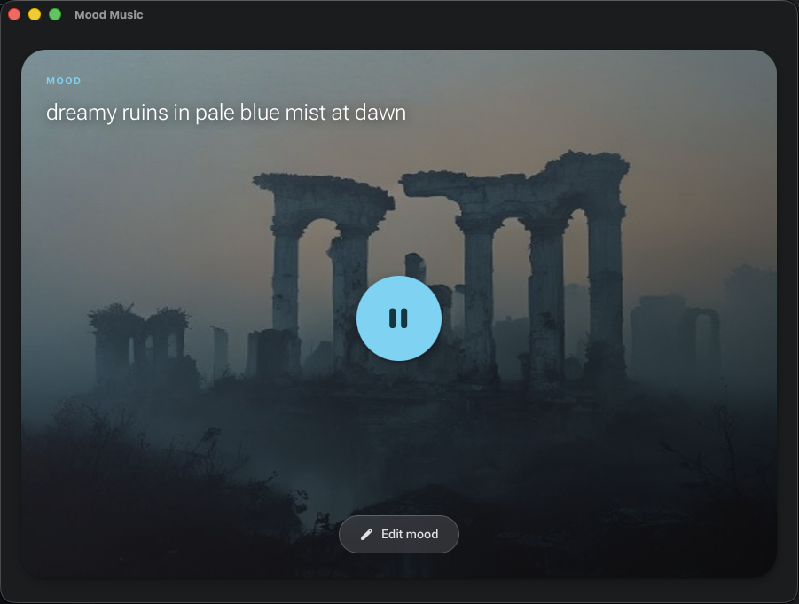

# Mood Music



A macOS desktop app that turns your mood into music. You build a sentence that describes how you feel — choosing words from themed word banks — and the app finds music that matches it, generates an AI background image, and adapts its color theme to the artwork.

Built with Tauri v2, React 19, and TypeScript.

---

## How it works

1. **Pick a theme** — Imaginary, Painting, Mineral, or Night Terrain. Each theme has its own visual language and word set.
2. **Build your mood sentence** — tap any highlighted word to swap it for an alternative. The sentence drives everything: image generation, music search, and color theming.
3. **Enter the zone** — the app starts playing bundled intro music immediately while it searches for a YouTube track that matches your mood in the background. When the track is ready it transitions automatically.

Tracks pre-fetch 20 seconds before the current one ends so playback never gaps. Music keeps playing even when you navigate back to edit your mood.

---

## Features

- **Instant audio** — four bundled ambient tracks play from the first tap; no waiting for the network
- **YouTube music search** — yt-dlp extracts a signed CDN stream URL; a Rust TCP proxy serves it to the audio element with full Range header support for seeking
- **Continuous playback** — pre-fetches the next track while the current one plays; cycles through search variations (`mix`, `playlist`, `session`, …) to return different results each time
- **AI-generated background** — Pollinations.ai generates a cinematic image from your mood sentence; its dominant palette is extracted with Material Color Utilities and applied as a live M3 dark theme
- **Spotify support** — connects via PKCE OAuth flow; searches for a mood-matching playlist and streams it through the Spotify Web Playback SDK
- **Setup wizard** — step-by-step instructions for creating Spotify developer credentials or a YouTube Data API key; YouTube works without any credentials at all
- **2-hour CDN cache** — repeat moods skip yt-dlp entirely and stream instantly from memory

---

## Requirements

| Dependency         | Purpose                                   |
| ------------------ | ----------------------------------------- |
| **yt-dlp**         | Extracts YouTube stream URLs and searches |
| **Rust toolchain** | Tauri native build                        |
| **Node 18+**       | Frontend build                            |

Install yt-dlp:

```bash
brew install yt-dlp
```

---

## Getting started

```bash
# Install JS dependencies
npm install

# Run in development
npm run app:dev

# Build a release DMG
npm run app:build
```

---

## Services

### YouTube Music (no account required)

Works out of the box. yt-dlp searches YouTube and streams audio directly — no sign-in, no API key needed.

**Optional:** add a YouTube Data API key in the setup screen to make music search significantly faster (~2 s vs ~12 s). Get one free at [console.cloud.google.com](https://console.cloud.google.com).

### Spotify

Requires a free Spotify developer app (Client ID) and a Spotify Premium account for in-app playback. The setup wizard walks through creating one at [developer.spotify.com/dashboard](https://developer.spotify.com/dashboard).

If Premium is not available, the app offers a link to open the mood playlist directly in the Spotify desktop app instead.

---

## Project structure

```
src/
  screens/
    SetupScreen.tsx       Setup wizard (service picker, credential steps)
    MoodEditorScreen.tsx  Theme tiles + interactive mood sentence
    PlaybackScreen.tsx    Background image, audio controls, phase machine
  context/
    AppContext.tsx         Global state; pre-warms YouTube stream URL on mood change
  utils/
    audioPlayer.ts        Module-level Audio singleton (survives screen transitions)
    spotifyAuth.ts        PKCE OAuth flow
    theme.ts              M3 palette extraction from image
    storage.ts            Tauri Store / localStorage persistence
  data/
    themes.ts             Theme definitions and mood token word banks

src-tauri/src/
  lib.rs                  Tauri commands: OAuth server, Spotify token exchange,
                          Pollinations image proxy, yt-dlp stream extraction,
                          Tokio TCP streaming proxy, CDN URL cache
```

---

## Tech stack

| Layer           | Technology                                                                       |
| --------------- | -------------------------------------------------------------------------------- |
| Shell           | Tauri v2                                                                         |
| Frontend        | React 19, TypeScript, Vite                                                       |
| Styling         | Material Design 3 (dark), dynamic color via `@material/material-color-utilities` |
| Icons           | Material Symbols Rounded                                                         |
| Audio (YouTube) | yt-dlp + custom Rust TCP proxy                                                   |
| Audio (Spotify) | Spotify Web Playback SDK                                                         |
| Image           | Pollinations.ai                                                                  |
| Persistence     | `tauri-plugin-store` with localStorage fallback                                  |
| HTTP (Rust)     | reqwest with streaming                                                           |
| Async (Rust)    | Tokio                                                                            |
